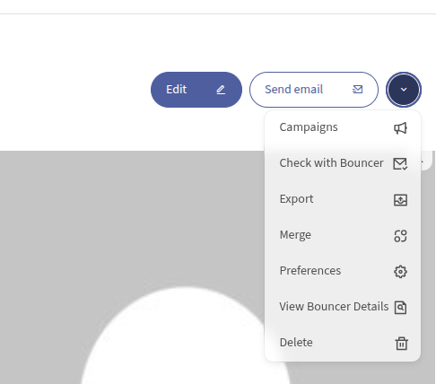
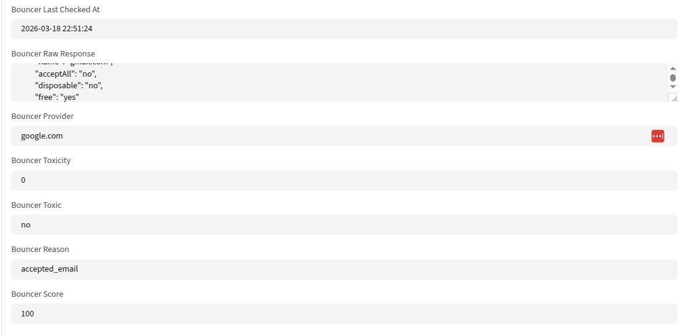

# LenonLeiteBouncerBundle

Bouncer email verification for Mautic, with single-contact checks, batch verification, request history, contact score visibility, and referral-ready Bouncer credit links.

## Why This Plugin Exists

Mautic stores a lot of emails, but not every email is good.

This plugin adds Bouncer verification directly into the Mautic workflow so you can:

- validate a single email before using it
- verify contacts in batch from the CLI
- store verification data on the contact record
- review request usage inside Mautic
- give admins a direct path to buy more Bouncer credits

If you want Bouncer credits or a Bouncer account, use the referral link:

- https://withlove.usebouncer.com/ioxhfxgs6zii

## What It Adds To Mautic

### Contact page

For contacts with an email address, the plugin adds:

- `Check with Bouncer`
- `View Bouncer Details`


### Contact edit page


### Contact list

On `/s/contacts`, the plugin adds:

- `Bouncer Score`

This keeps the list simple while still surfacing quick quality context.

### Admin dashboard

The plugin adds a requests page:

- `/s/bouncer/requests`

This dashboard shows:

- request history
- source of each request
- batch or single-check status
- quantities processed
- estimated credits used
- referral CTA to buy more Bouncer credits

### Config page

The plugin adds:

- `Bouncer Settings`

Path:

- `/s/config/edit?tab=bouncerconfig`

The config page includes:

- enable/disable toggle
- API key field
- auto-check option
- batch size and sync limit
- a referral button for buying more Bouncer credits

## Main Features

- Single email verification from the contact page
- Batch verification from the command line
- Request tracking in Mautic
- Lead field persistence for verification data
- Contact list score column
- Admin UI with referral CTA
- Tests for commands, UI integration, config page, and service logic

## Requirements

- Mautic 5.2
- A valid Bouncer API key
- Plugin installed and published

## Installation

Place the plugin in:

```text
plugins/LenonLeiteBouncerBundle
```

Then reload plugins and publish the bundle in Mautic.

After installation:

1. Open plugin configuration.
2. Go to `Bouncer Settings`.
3. Add your Bouncer API key.
4. Save the configuration.

## Configuration

Open:

```text
/s/config/edit?tab=bouncerconfig
```

Available settings:

- `Enable Bouncer integration`
- `Bouncer API key`
- `Check new contacts automatically`
- `Default batch size`
- `Default sync request limit`

The config page also includes the referral CTA:

- `Buy Credits with Referral`

Referral URL:

- https://withlove.usebouncer.com/ioxhfxgs6zii

## Single Contact Verification

On a contact page, click:

- `Check with Bouncer`

The plugin will:

1. Send the email to Bouncer.
2. Normalize the response.
3. Save the result on the contact.
4. Log the request in the Bouncer dashboard.
5. Redirect to the details screen.

To review the result, click:

- `View Bouncer Details`

## Stored Contact Fields

The plugin writes these fields to the lead:

- `bouncer_status`
- `bouncer_score`
- `bouncer_reason`
- `bouncer_toxic`
- `bouncer_toxicity`
- `bouncer_provider`
- `bouncer_raw_response`
- `bouncer_last_checked_at`

If these fields do not exist yet, the plugin creates them automatically.

## Batch Verification Workflow

Batch verification is asynchronous.

That means:

- `batch-create` sends the emails to Bouncer
- `batch-sync` imports the results later

### 1. Create a batch

```bash
php bin/console bouncer:verify:batch-create --limit=100
```

You can also start after a specific contact ID:

```bash
php bin/console bouncer:verify:batch-create --limit=100 --min-id=5000
```

This command returns:

- `Submitted`
- `Batch ID`
- `Request ID`

Meaning:

- `Batch ID` is the Bouncer batch hash/id
- `Request ID` is the local Mautic request row

### 2. Wait for Bouncer to process the batch

Bouncer may take some time to complete the batch.

### 3. Sync results into Mautic

```bash
php bin/console bouncer:verify:batch-sync
```

Optional:

```bash
php bin/console bouncer:verify:batch-sync --limit=20
```

This command:

1. Loads queued, pending, or processing requests
2. Checks the batch status at Bouncer
3. Downloads completed results
4. Matches rows by email
5. Writes the result to the related contacts

Expected command output:

- `Requests synced`
- `Results processed`
- `Leads updated`

## Recommended Batch Usage

Typical flow:

```bash
php bin/console bouncer:verify:batch-create --limit=100
php bin/console bouncer:verify:batch-sync
```

If the batch is not completed yet, wait and run sync again:

```bash
php bin/console bouncer:verify:batch-sync
```

## Understanding Results

Main Bouncer statuses:

- `deliverable`: email appears valid
- `risky`: email may work but should be treated carefully
- `undeliverable`: email is invalid or rejected
- `unknown`: Bouncer could not confirm it

Common fields:

- `score`: general confidence or deliverability score
- `reason`: more specific explanation from Bouncer
- `toxic`: toxic signal, normalized as yes/no/unknown
- `toxicity`: toxicity level when returned
- `provider`: detected mailbox provider

## Where To Review Results

### Per-contact

Open a contact and use:

- `View Bouncer Details`

### Request history

Open:

```text
/s/bouncer/requests
```

This page is useful for:

- reviewing batches
- checking whether requests were processed
- estimating local usage
- accessing the referral CTA when you need more credits

## Referral

If you need a Bouncer account or more verification credits, use:

- https://withlove.usebouncer.com/ioxhfxgs6zii

This link is included in:

- the config page
- the Bouncer requests dashboard
- the lead details page
